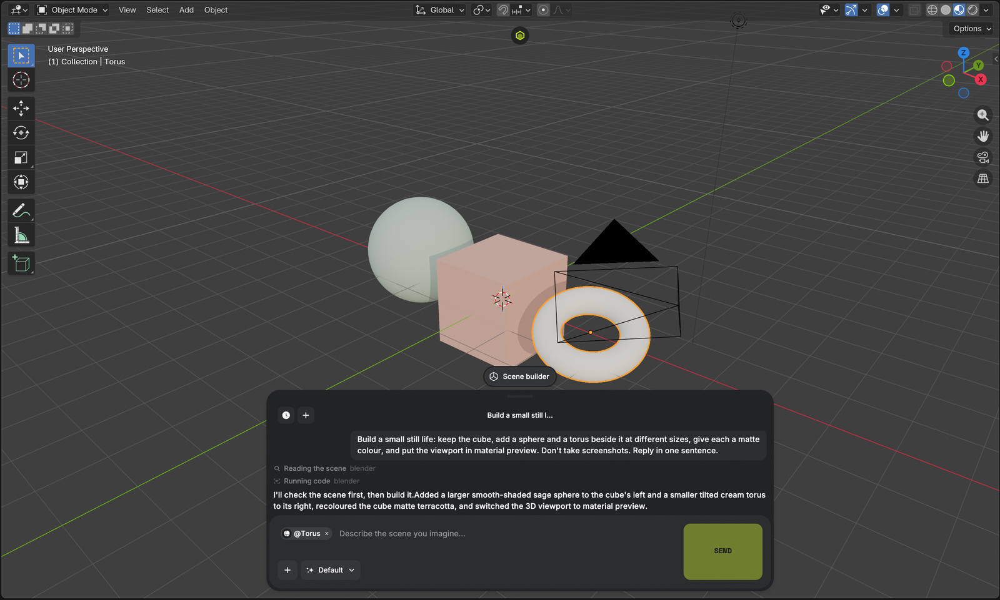

# Scene Agent

Drive Blender from your own Claude Code (or, later, Codex) CLI — from a chat
drawn over the viewport, or from any terminal on the same machine.



```
you type in the viewport
  → features/agent.py spawns `claude -p --output-format stream-json`
  → that CLI starts `python -m blmcp` (stdio MCP, bundled wheel)
  → which connects to 127.0.0.1:9876
  → which runs bpy on Blender's main thread
```

The add-on holds no credential and talks to no service of its own. Your CLI
authenticates itself, the way it does when you run it in a terminal, and the
model you are paying for is the model you get.

## Install

1. Install a coding CLI and sign in to it in a terminal — today that means
   [Claude Code](https://claude.com/claude-code). (`codex` is scaffolded in
   `features/agent.py` but not wired up yet; picking it reports as much.)
2. Download `scene_agent.zip` from Releases.
3. Blender → Edit → Preferences → Get Extensions → ▾ → Install from Disk.
4. Open Preferences → Add-ons → Scene Agent and check that it found your CLI.
   If Blender was launched from the Finder or a desktop icon it has none of
   your shell's `PATH`, so point **Executable** at the binary directly.

The prompt appears over the viewport on its own. Press `N` for the sidebar if
you would rather see the bridge status and the setup for your own terminal.

## Attaching images

Drag a PNG, JPG, GIF, WEBP or PDF out of the Finder and onto the prompt: it
becomes a chip. `Cmd/Ctrl+V` does the same for a picture on the clipboard —
a screenshot you just took, or a file copied in a file manager — and the `+`
button opens a file picker. The
path travels with your question and your CLI opens it where it lies — nothing
is uploaded anywhere. "Match this reference", "build what is in this photo",
"the colours from this frame" all work.

Those five formats are the whole list because they are what the CLI can
actually read. A BMP, a TIFF or an MP4 is refused at the drop rather than
accepted and then failed halfway through a turn.

If an attachment does not arrive, the add-on says why in its log —
`~/Library/Logs/SceneAgent/Blender/blender.log` on macOS, the same folder
Preferences → Support Logs opens. Every line about this is tagged
`area=attach`: `drop_hover` is a drag passing over the prompt, `picker_*` is
the file browser, `paste_media` is `Cmd+V` finding a picture.

## Preferences worth knowing

**Extra models.** The picker ships the current aliases — `opus`, `sonnet`,
`haiku`, `fable`, each with a `[1m]` long-context variant — plus some pinned
releases. Anything newer goes in this field, comma separated, as `id` or
`id = Label`. `Default` sends no `--model` at all, so the CLI's own configured
model wins, which is the right answer for most people.

**Give the agent shell and file access.** Off by default. Off, the agent gets
Blender plus read-only file tools. On, it gets the CLI's full tool set —
running commands and writing files on this machine — with permission prompts
bypassed, because there is no terminal to answer them. Turn it on only if you
would have run the CLI that way yourself.

## Using this Blender from your own terminal

The sidebar's **Agent** panel has a Copy button that puts a ready
`claude mcp add-json blender '…'` line (or the Codex `config.toml` block) on
the clipboard. Paste it into a shell and any session of your CLI can drive the
Blender you have open.

The MCP server itself is `blmcp` by the Blender Authors: `execute_blender_code`
plus screenshots, scene summaries, viewport navigation and the bundled bpy API
docs. Nothing in it is specific to this add-on — the add-on's own contribution
is the localhost bridge that runs it on Blender's main thread, and the chat.

## What this is a fork of

The Higgsfield Blender add-on, with the account taken out. Removed:

| Removed | Was |
| --- | --- |
| OAuth device flow, token file, SDK client | `fnf/account.py`, `fnf/session.py` |
| Outbound WebSocket to their MCP worker | `bridge_runner.py` |
| The hosted agent and its poll loop | `features/supercomputer.py` |
| Amplitude telemetry and the baked API key | `analytics.py`, `build_config.py` |
| The auto-updater | `features/updates.py` |
| Image / video / 3D / motion generation, Results, credits, the phone camera | `fnf/`, `features/{motion,tools,realtime,phonecam}`, `sidebar/gallery.py` |

The generation features were the account's, not the add-on's: every one of them
was a call to a paid API. Deleting them took about fifteen thousand lines and
roughly half the bundled wheels with it — the phone camera alone carried a
WebRTC stack.

The auto-updater is the removal that mattered most. Pointed at the vendor's
manifest, it would have reinstalled the vendor's build — account and all — on
the next Blender start.

## Building from source

```sh
git clone https://github.com/Bloodrabbid/blender-scene-agent
cd blender-scene-agent
zip -r scene_agent.zip . -x '.git/*' 'docs/*'
```

Blender installs the wheels under `wheels/` itself; nothing runs `pip` at
runtime. The extension is `blender_manifest.toml`, so `blender_version_min` and
the wheel list live there.

## Licence

GPL-3.0-or-later, unchanged from upstream. See `LICENSE`, and `NOTICE` for what
is whose. Not affiliated with Higgsfield Inc.
